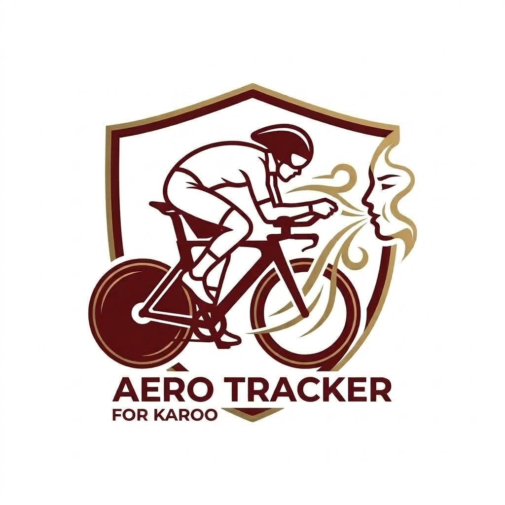

<p align="center">
  
</p>

# Aero Tracker — Estimador CdA para Karoo 2/3

> **Túnel de viento virtual para tu Hammerhead Karoo 2/3**
> Calcula tu Coeficiente de Arrastre Aerodinámico (CdA) en tiempo real usando datos de potencia, velocidad y desnivel.

*Read this in other languages: [English](README_en.md)*

---

## ¿Qué es Aero Tracker?

Aero Tracker es una extensión para el ciclocomputador Hammerhead Karoo 2 y Karoo 3 que estima tu **CdA (Coefficient of Drag Area)** en tiempo real durante el entrenamiento, sin necesidad de una sesión formal de túnel de viento.

### Física detrás del cálculo

```
P_total = P_aero + P_rodadura + P_gravedad

P_aero    = 0.5 × ρ × CdA × (v + v_viento)² × v
P_rodadura = Crr × m × g × v
P_gravedad = m × g × grad × v

⟹ CdA = (P - P_rod - P_grav) / (0.5 × ρ × v_rel² × v)
```

Donde:
- **ρ** = densidad del aire (ajustada por altitud)
- **v** = velocidad del ciclista en m/s
- **m** = masa total (ciclista + bici) en kg
- **Crr** = coeficiente de rodadura (~0.004 para carretera)

---

## Campos de datos disponibles en el Karoo

| Campo | ID | Descripción | Unidad |
|---|---|---|---|
| CdA en vivo | `aerotracker-cda` | CdA calculado cada segundo | m² |
| CdA suavizado | `aerotracker-cda-smooth` | Media móvil 5 segundos | m² |
| W ahorrados | `aerotracker-watts-saved` | Vatios ahorrados vs postura base (CdA 0.32) | W |
| Potencia Aero | `aerotracker-power-aero` | % de potencia para vencer el viento | W |
| Postura Aero | `aerotracker-category` | Categoría descriptiva | — |

---

## Categorías de CdA

| CdA | Categoría | Descripción |
|---|---|---|
| < 0.20 | 🟢 Super Aero | Posición TT extrema (cabeza muy baja) |
| 0.20–0.25 | 🟢 Aero | Posición TT o drops agresivo |
| 0.25–0.32 | 🟡 Eficiente | Drops cómodo o semi-aero |
| 0.32–0.40 | 🟠 Normal | Sentado erguido, manos en cuernos |
| > 0.40 | 🔴 Muy erguido | Manos en capota, torso muy vertical |

---

## Requisitos

- **Dispositivo**: Hammerhead Karoo 2 o Karoo 3
- **Sensores necesarios**:
  - ✅ Potenciómetro (Power Meter) — **obligatorio**
  - ✅ Velocidad GPS o sensor de velocidad — **obligatorio**
  - 📡 Sensor de cadencia — opcional (mejora exactitud)
- **Sensores opcionales**:
  - Barómetro (para desnivel preciso — ya integrado en Karoo)

---

## Instalación

### Método 1: Hammerhead Extension Library (recomendado)
1. Crea una cuenta en [dashboard.hammerhead.io](https://dashboard.hammerhead.io)
2. Busca "Aero Tracker" en la Extension Library del Karoo
3. Instala y reinicia el dispositivo

### Método 2: Sideload (testing)
```bash
# Compilar APK
./gradlew assembleRelease

# Instalar via ADB (Karoo conectado por USB)
adb install app/build/outputs/apk/release/app-release.apk
```

---

## Configuración

### Parámetros por defecto
```
Masa ciclista:  75 kg
Masa bicicleta:  8 kg
Crr (rodadura): 0.004 (asfalto mojado = 0.006, asfalto seco = 0.003)
CdA base:       0.32 (postura erguida normal)
Suavizado:       5 segundos
```

### Recomendaciones de uso

1. **Llano sin viento**: Los resultados más fiables se obtienen en segmentos llanos
2. **Velocidad mínima**: El cálculo requiere >10 km/h y potenciómetro activo
3. **Prueba de posturas**: Mantén 30+ segundos en cada posición para ver el efecto
4. **Referencia de mejora**: El campo "W ahorrados" compara con CdA base 0.32

---

## Estructura del Proyecto

```
app/src/main/kotlin/com/aerotracker/karoo/
├── MainActivity.kt                    # Pantalla de config/simulador
├── engine/
│   └── CdaCalculator.kt              # Motor de física del CdA
├── extension/
│   └── AeroTrackerExtension.kt       # Servicio de extensión Karoo
├── model/
│   └── AeroModels.kt                 # Modelos de datos
└── ui/
    ├── AeroGaugeView.kt              # Medidor de aguja personalizado
    └── theme/
        └── AeroTrackerTheme.kt       # Tema dark
```

---

## Roadmap

- [ ] **v1.1**: Integración con API OpenWeatherMap (datos de viento en tiempo real)
- [x] **v1.2**: Pantalla Karoo personalizada con medidor de aguja tipo "túnel de viento"
- [ ] **v1.3**: Modo comparación de posturas (guardar sesiones para comparar)
- [ ] **v1.4**: Exportación de datos CdA a Strava/Garmin Connect
- [ ] **v2.0**: Calibración automática con sesión de referencia

---

## 📦 Compilación para Desarrolladores

El proyecto utiliza Gradle y Kotlin. Requiere JDK 17 y Android SDK (Plataforma 34).

```bash
./gradlew assembleDebug # Compila el APK de prueba
./gradlew testDebugUnitTest # Ejecuta los test matemáticos
```

---

## 🤝 Créditos y Agradecimientos

- Construido sobre el SDK oficial [karoo-ext](https://github.com/hammerheadnav/karoo-ext) de Hammerhead (Licencia Apache 2.0).
- Inspirado por la comunidad open-source de modding para Karoo (como la mítica extensión *Ki2* o *Climber+*).
- Desarrollado por **David García Pascual**.

📄 **Licencia y Descargo de Responsabilidad**

Este proyecto de código abierto se distribuye bajo la licencia **MIT** - Copyright 2026 David García Pascual. *Descargo de responsabilidad: Esta extensión no está afiliada, respaldada, patrocinada ni soportada por Hammerhead o SRAM. Úsala bajo tu propio riesgo y, por favor, mantén siempre los ojos en la carretera y las manos en el manillar.*

---

## ☕ Apoya el proyecto

Si esta extensión te ha resultado útil y quieres apoyar su continuo desarrollo:

<a href="https://www.buymeacoffee.com/" target="_blank"></a>
